# myls — phần cài đặt `ls(1)` đơn giản hóa
# Hà Điền Trung Hiếu - 24IT062 - Midterm 
Chương trình bài giữa kỳ: cài đặt lại tiện ích `ls(1)` theo trang man page của
NetBSD đi kèm đề bài.

## Yêu cầu

- Hệ Linux (glibc) hoặc NetBSD.
- `gcc` (hoặc clang) hỗ trợ `-std=c11`.
- `make` GNU trên Linux; `bmake` (mặc định trên NetBSD) cũng chạy được.

Một `Makefile` duy nhất, cùng một cờ (`-D_NETBSD_SOURCE`) dựng được trên cả
hai hệ; không cần `./configure`.

## Biên dịch

```sh
make          # dựng ./myls
make clean    # xóa mọi file đã sinh
```

## Cách chạy

```sh
./myls                 # nội dung thư mục hiện tại
./myls [tùy chọn] [file ...]
```

Không có operand nào thì liệt kê thư mục hiện tại (`-d` làm ngược lại: in chính
nó). Nhiều operand: file thường in trước, thư mục in sau, mỗi thứ sắp riêng.
Khi có từ hai operand trở lên (hoặc `-R`), mỗi thư mục được in kèm dòng tiêu đề
`thư-mục:`.

## Các tùy chọn (19)

| Tùy chọn | Ý nghĩa |
| --- | --- |
| `-A` | In mọi mục trừ `.` và `..` |
| `-a` | In tất cả, gồm cả `.` và `..` |
| `-c` | Dùng thời điểm đổi trạng thái (cho `-t` và `-l`) |
| `-d` | Thư mục operand in như file thường |
| `-F` | Gắn hậu tố loại: `/` thư mục; `*` thực thi; `@` symlink; `=` socket; `\|` FIFO; `%` whiteout |
| `-f` | Không sắp xếp, in theo thứ tự đọc; kéo theo `-a` |
| `-h` | In kích thước dạng người đọc (`512`, `1.0K`, `12M`, `2.5G`) |
| `-i` | In số inode mỗi mục |
| `-k` | In khối làm tròn lên theo kibibyte |
| `-l` | In định dạng dài (quyền, số liên kết, chủ, nhóm, kích thước, thời gian) |
| `-n` | Như `-l` nhưng uid/gid hiện số |
| `-q` | In byte không in được thành `?` (mặc định khi ra terminal) |
| `-R` | Duyệt đệ quy mọi thư mục con |
| `-r` | Đảo ngược thứ tự |
| `-S` | Sắp theo kích thước, lớn trước; bằng nhau giữ thứ tự đọc |
| `-s` | In số khối mỗi mục |
| `-t` | Sắp theo thời gian, mới trước |
| `-u` | Dùng thời gian truy cập cuối (cho `-t` và `-l`) |
| `-w` | In nguyên byte không in được (mặc định khi ra ống dẫn) |

Luật đè lẫn nhau ("cái cuối thắng"): `-l`/`-n`, `-c`/`-u`, `-R`/`-d`,
`-q`/`-w`, `-h`/`-k`. `-f`/`-A`/`-a` cùng một trường `dot_mode`, nên `-f -A`
tắt hiệu lực `-a`. Với super-user, `-A` luôn có hiệu lực trừ khi ghi rõ `-a`.

Định dạng ngắn đi theo cột khi ra terminal, canh theo mục rộng nhất; khi ra
ống dẫn thì một mục mỗi dòng.

## Kiểm thử

Hai script trong `tests/` (chạy trên Linux):

```sh
bash tests/mkfixture.sh <thư-mục>   # sinh cây file mẫu với đủ loại mục
bash tests/compare.sh ./myls <thư-mục>  # so ./myls với /bin/ls theo từng tùy chọn
```

Kết quả trên cây mẫu hiện tại: **86 phép so, 79 khớp, 7 khác biệt đã biết**
(`-l`/`-n` căn cột theo GNU, `-R` in tiêu đề thư mục gốc, `-S` giữ thứ tự đọc
cho thư mục, `-f -A`/`-fr` làm khác `-f` của GNU). So với `/bin/ls` của
NetBSD trên VM NetBSD 10.2, mọi mục qua khớp; lệch là 3 nhóm kiểu chấm câu
(`-l` căn cột, `-S` tie, `-R` header).

## Cấu trúc repo

| File | Vai trò |
| --- | --- |
| `main.c` | Điều phối: operand, đệ quy bằng stack |
| `options.[ch]` | Phân tích dòng lệnh |
| `listing.[ch]` | Đọc thư mục, chẩn đoán lỗi |
| `statinfo.[ch]` | `struct stat` → chuỗi in |
| `sort.[ch]` | Sắp xếp (merge sort ổn định) |
| `format.[ch]` | Dàn trang, dòng `total N` |
| `ls_types.h` | Kiểu dữ liệu dùng chung |
| `tests/` | Script sinh fixture và so sánh khác biệt |

## Screenshots

### 1. Build từ GitHub

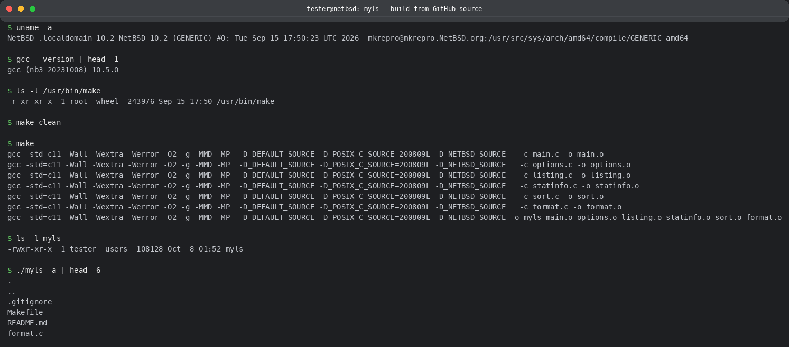

### 2. Chạy trên fixture

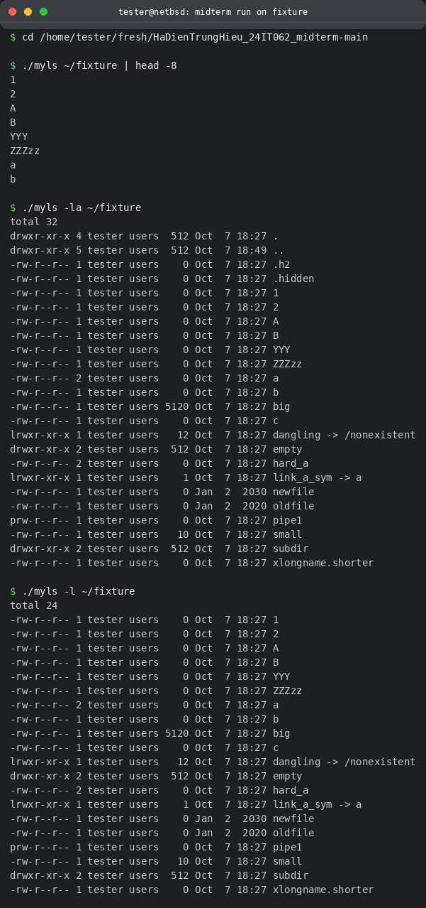

### 3. So sánh với `/bin/ls`

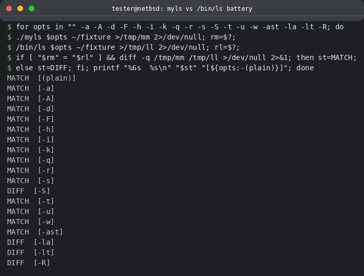

### 4. File dot (`-a` / `-A`)

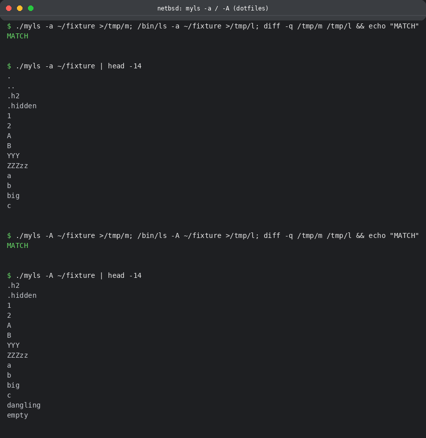

### 5. Format dài và sắp xếp (`-l` `-lt` `-ltr` `-t` `-u` `-S`)

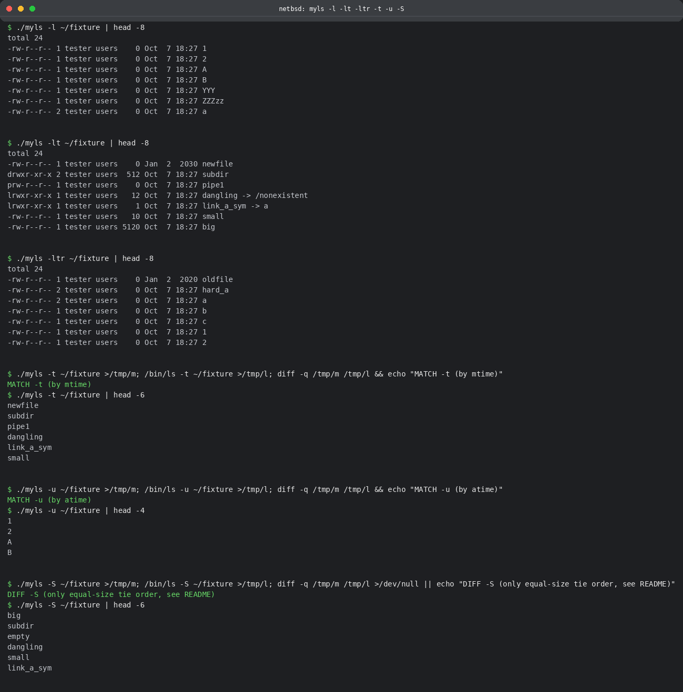

### 6. Inode và kích thước (`-i` `-lhi` `-ils` `-lk`)

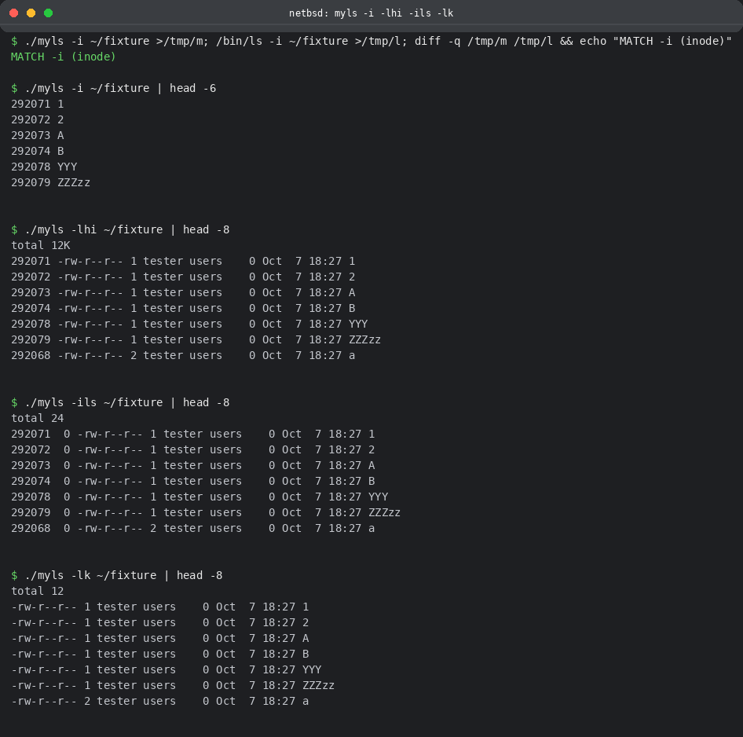

### 7. Phân loại, thư mục, link (`-F` `-d` symlink/hardlink)

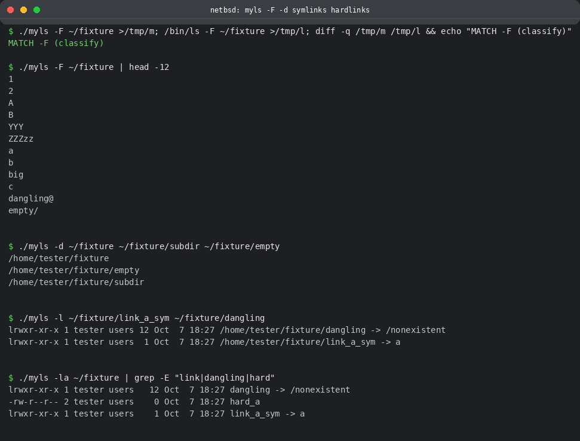

### 8. Đệ quy (`-R`)

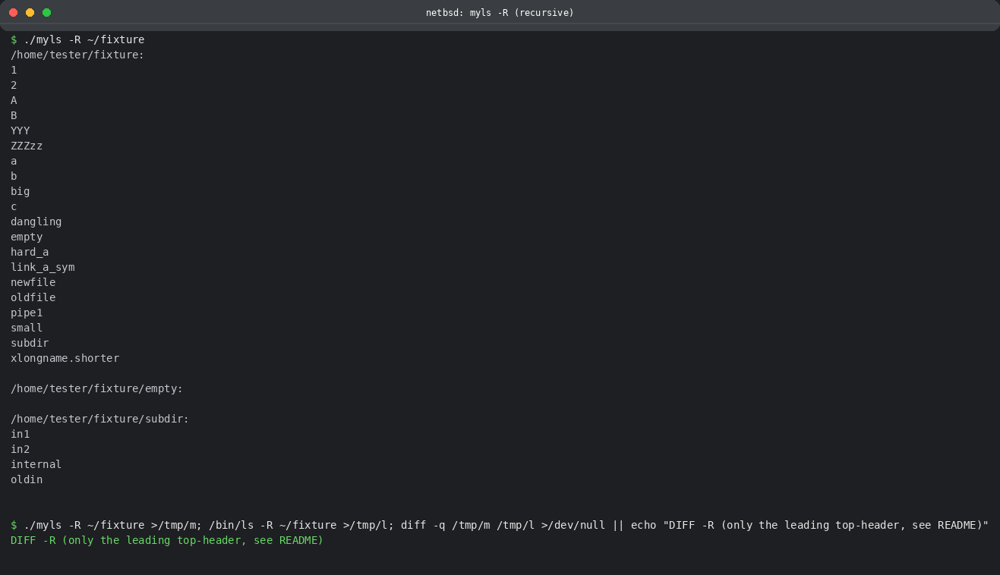

### 9. Byte thô và tổ hợp (`-w` `-q` `-la` `-ast`)

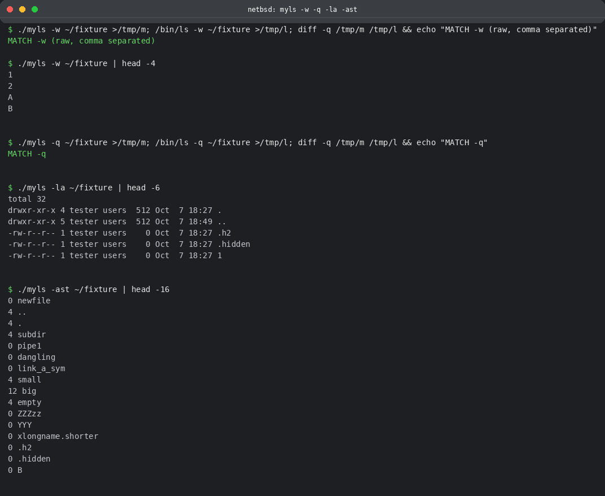

### 10. Harness trên Linux

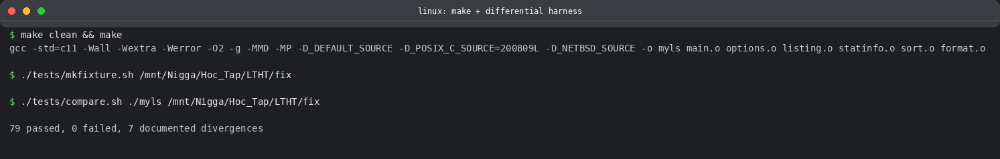

### 11. Các tùy chọn còn lại (`-c` `-f` `-n` `-r`)

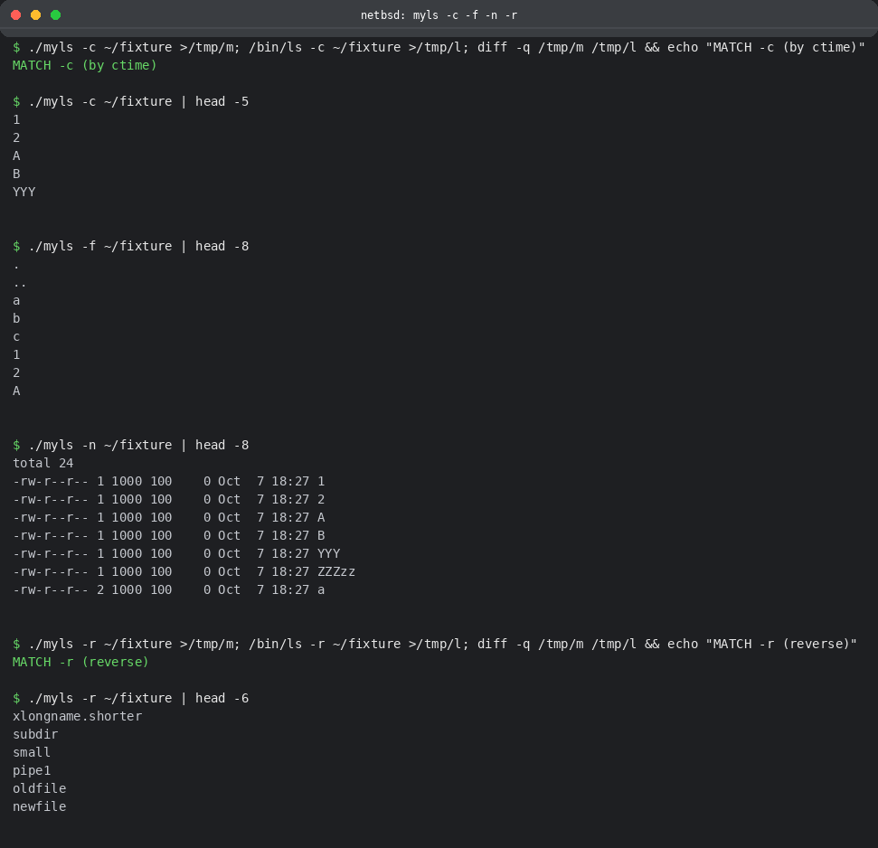

### 12. Cấu trúc repo

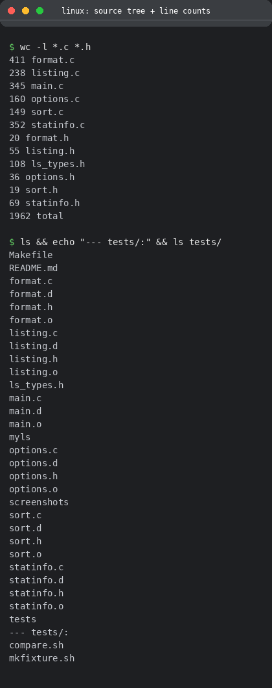
